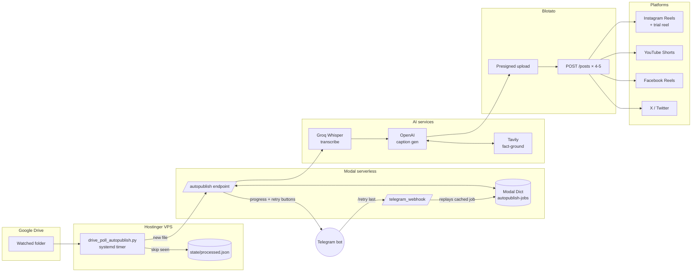

# Auto-Publish — One Drive Drop, Nine Posts

Drop a video into a Google Drive folder. Two minutes later, that video is posted (or scheduled) to Instagram, YouTube Shorts, Facebook Reels, and X — with a transcribed, fact-checked, platform-optimized caption for each one.

One serverless endpoint. One systemd timer. Zero copy-paste between platforms.

> **Status:** running in production for [@ssktechy](https://instagram.com/ssktechy) (180K+ Telugu) and [@ssktechy.ai](https://instagram.com/ssktechy.ai) (English) — handling ~30 videos/week across 9 platform accounts.

[](https://github.com/sskghub/auto-publish/actions/workflows/ci.yml)
[](https://modal.com)
[](https://blotato.com)
[](LICENSE)
[](.pre-commit-config.yaml)

## Demo


*2-min walkthrough: [Loom link placeholder](https://loom.com/share/REPLACE_ME)*

## Why it exists

Posting one video to nine accounts means nine different captions, three different aspect-ratio rules, two languages, manual scheduling in two dashboards, and an entire afternoon every week. Most "auto-posters" handle the upload but not the writing — the captions still get generated by hand, badly, at 1am.

This project does the writing too. The transcript drives a Tavily-grounded prompt, so the captions name the actual tool the video covers (no "this amazing AI tool" filler), respect each platform's tone, and stay inside YouTube's title-character constraints.

The whole thing is one HTTP endpoint and one cron — small enough to fork, audit, and bend to a different posting service.

## Architecture



**Three independent surfaces:**

1. **VPS poller** (`drive_poll_autopublish.py`) — lists the Drive folder on a `systemd` timer, dedupes against a local state file, POSTs new files to Modal sequentially. Idempotent: only marks a file processed when Modal returns `status: "completed"`.
2. **Modal endpoint** (`autopublish_app.py`) — runs the full pipeline (download → transcribe → caption → post). Caches every step in a `modal.Dict` keyed by `job_id` so retries skip the expensive AI work and only re-post the failed platforms.
3. **Telegram bot** — real-time progress, inline "Retry all failed / Retry IG / Retry YT" buttons, and natural-language retries (`/retry telugu instagram`, `/retry last`). Allowlist-gated, fail-closed.

## What's inside the captions

Each video produces 4 (Telugu) or 5 (English) posts, each with platform-tuned copy from a single prompt:

| Field | Tuned for |
|-------|-----------|
| `yt_title` | YouTube Shorts ranking — primary keyword in first 30 chars, no `<` `>` (YouTube API rejects them), 25-55 chars |
| `yt_description` | First 2 sentences carry SEO weight; ends with `#ssktechy`, no CTA filler |
| `ig_caption` | Hook in line 1 (drives algorithmic weight); 4 niche hashtags + 1 brand hashtag |
| `x_post` | <280 chars, no hashtags, no emojis, conversational |

Tavily grounds the prompt with verified facts about whatever tool the video covers, so the model can't hallucinate version numbers or tool names from a fuzzy Whisper transcript.

## Filename → schedule

The Drive filename **is** the trigger. No web UI, no spreadsheet:

| Pattern in filename | Effect |
|---------------------|--------|
| `My video TE.mp4` | Telugu run (4 posts), queued to next Blotato slot |
| `My video EN #now.mp4` | English run (5 posts), publish immediately |
| `My video EN 2026-04-30 9:00 AM.mp4` | Schedule for that wall-clock time in **America/Chicago** |
| `My video TE April 30, 2026 at 6:00 PM.mp4` | Same, natural-language form |

`TE` / `EN` is mandatory and selects the account map. Schedule strings without a year are rejected.

## Security

- **No hardcoded credentials anywhere.** Blotato API key, Telegram chat IDs, account/platform IDs all come from Modal secrets or `.env`. The repo ships `*.example.json` and `env.example` only.
- **Modal endpoint is Bearer-protected.** Calls without `Authorization: Bearer $API_AUTH_TOKEN` are rejected.
- **Telegram retry webhook is fail-closed.** If `TELEGRAM_ALLOWED_CHAT_IDS` is unset, the webhook returns 503 (no requests reach the pipeline).
- **Telegram retry dedupe.** Identical retry requests within `TELEGRAM_RETRY_DEDUPE_SECONDS` (default 45) are dropped — protects against double-tap on inline buttons.
- **Errors are logged, never silently swallowed.** Telegram and Blotato polling failures write to stderr (visible in Modal / `journalctl`) so partial outages don't go invisible for hours.
- **`pre-commit` config blocks secrets.** `gitleaks` runs on every commit; `.gitignore` blocks `.env`, `*.token`, `service-account*.json`, `accounts.json`, `platforms.json`.

## What you need

- Python 3.11+
- [Modal](https://modal.com) account
- [Blotato](https://blotato.com) account with the platforms you want connected
- [Groq](https://groq.com) API key (Whisper transcription, free tier works)
- [OpenAI](https://platform.openai.com) API key (caption generation)
- [Tavily](https://tavily.com) API key (fact grounding, free tier works)
- A Telegram bot ([create one via BotFather](https://t.me/botfather))
- For the VPS poller: any small Linux box with `systemd` + a Google Cloud service account that can read your Drive folder

## Setup

### 1. Install

```bash
git clone https://github.com/<you>/auto-publish.git
cd auto-publish
python3 -m venv .venv && source .venv/bin/activate
pip install -r deploy/requirements-drive-poll.txt
pre-commit install
python -m modal setup
```

### 2. Configure your accounts

```bash
cp accounts.example.json accounts.json
cp platforms.example.json platforms.json
# Edit both with your real Blotato account IDs (find them at my.blotato.com)
```

`accounts.json` and `platforms.json` are gitignored. The Modal app reads `accounts.json` from a Modal secret (next step); `post_video.py` reads `platforms.json` from disk locally.

### 3. Create Modal secrets (one-time)

```bash
modal secret create blotato-api-key BLOTATO_API_KEY="blt_..."
modal secret create openai-secret OPENAI_API_KEY="sk-..."
modal secret create groq-api-key GROQ_API_KEY="gsk_..."
modal secret create tavily-api-key TAVILY_API_KEY="tvly-..."
modal secret create api-auth-token API_AUTH_TOKEN="$(openssl rand -hex 32)"

modal secret create telegram-autopublish-bot \
  TELEGRAM_BOT_TOKEN="123:ABC..." \
  TELEGRAM_CHAT_ID="your_personal_chat_id" \
  TELEGRAM_ALLOWED_CHAT_IDS="your_personal_chat_id"

# accounts-json must be the contents of accounts.json on a single line
modal secret create accounts-json ACCOUNTS_JSON="$(cat accounts.json | tr -d '\n')"
```

### 4. Deploy

```bash
modal deploy autopublish_app.py
```

You'll get two URLs:

- `https://<workspace>--replix-autopublish-autopublish.modal.run` — pipeline endpoint
- `https://<workspace>--replix-autopublish-telegram-webhook.modal.run` — Telegram webhook

### 5. Wire the Telegram webhook

```bash
curl "https://api.telegram.org/bot<BOT_TOKEN>/setWebhook?url=https://<workspace>--replix-autopublish-telegram-webhook.modal.run"
```

### 6. Deploy the Drive poller (optional but recommended)

See [`deploy/README.md`](deploy/README.md) for the full VPS setup (`systemd` units, Google service account, `.env`).

## Usage

### Push a video by dropping it in Drive

If the poller is running: drop `Whatever EN #now.mp4` into your watched folder. Done.

### Trigger manually

```bash
curl -X POST https://<workspace>--replix-autopublish-autopublish.modal.run \
  -H "Authorization: Bearer $API_AUTH_TOKEN" \
  -H "Content-Type: application/json" \
  -d '{
    "video_url": "https://drive.usercontent.google.com/download?id=FILE_ID&export=download&confirm=t",
    "caption": "My video EN #now.mp4"
  }'
```

### Dry run (test the pipeline without posting)

Add `"dry_run": true` to the body. Runs download + transcribe + caption gen, returns a `job_id`, posts nothing.

### Retry a failed platform

```bash
# CLI
export MODAL_AUTOPUBLISH_URL="https://<workspace>--replix-autopublish-autopublish.modal.run"
export API_AUTH_TOKEN="..."
python3 retry_autopublish.py JOB_ID yt_en fb_en

# Telegram
/retry last                  # all failed platforms from your most recent job
/retry telugu instagram
/retry EN Facebook trial
```

Retries skip the AI steps entirely (zero cost, ~5 sec per platform).

Platform keys: `ig_te`, `yt_te`, `fb_te`, `ig_te_trial`, `ig_en`, `yt_en`, `fb_en`, `x_en`, `ig_en_trial`.

### Post a single video without the AI pipeline

```bash
python3 post_video.py /path/to/video.mp4 --platforms yt_en fb_en
```

Reads `BLOTATO_API_KEY` from a local `.env`; uses `platforms.json`.

## File map

| File | Purpose |
|------|---------|
| `autopublish_app.py` | Modal app — endpoint, Telegram webhook, full pipeline, retry cache |
| `drive_poll_autopublish.py` | VPS poller — lists Drive, POSTs new files to Modal |
| `retry_autopublish.py` | Local CLI — retry one or more platforms by `job_id` |
| `post_video.py` | Local CLI — post a single video bypassing the AI step |
| `accounts.example.json` | Schema for the `accounts-json` Modal secret |
| `platforms.example.json` | Schema for `platforms.json` (used by `post_video.py`) |
| `deploy/` | VPS deploy guide + `systemd` units + poller `requirements.txt` |
| `tests/` | pytest suite for the pure helper functions (46 tests) |
| `.github/workflows/ci.yml` | GitHub Actions: pytest on Python 3.11 + 3.12 |
| `CLAUDE.md` | Internal architecture notes (deeper than this README) |

## Tests

The pure helper functions (`_parse_caption`, `_infer_retry_keys_natural`, `_schedule_iso_central`) have pytest coverage. Tests run automatically on every push to `main` via GitHub Actions (Python 3.11 + 3.12 matrix).

Run locally:

```bash
python3 -m venv .venv && source .venv/bin/activate
pip install pytest httpx fastapi tzdata
pytest tests/ -v
```

`tests/conftest.py` stubs the `modal` module at import time so tests don't need a Modal account or network access.

## Repo hygiene

Before every commit:

```bash
pre-commit run --all-files            # gitleaks + ruff + file checks
trufflehog filesystem . --no-update   # belt-and-suspenders secret scan
```

Never `git add -f` — that bypasses `.gitignore` and is the most common way real secrets leak.

## License

MIT — see [LICENSE](LICENSE).

## Changelog

See [CHANGELOG.md](CHANGELOG.md).
